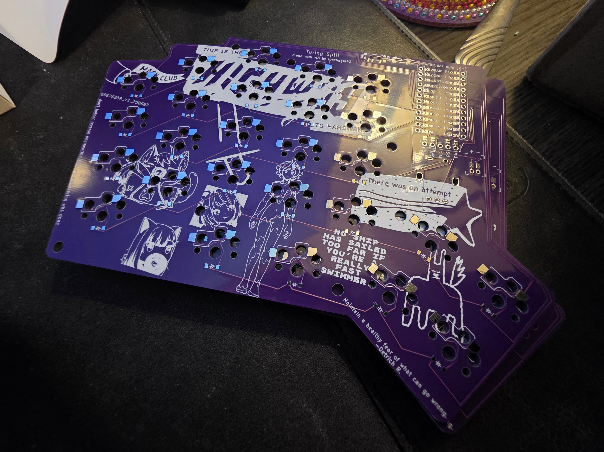
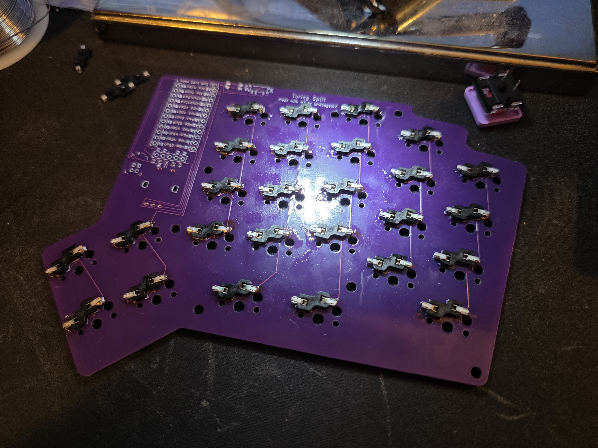
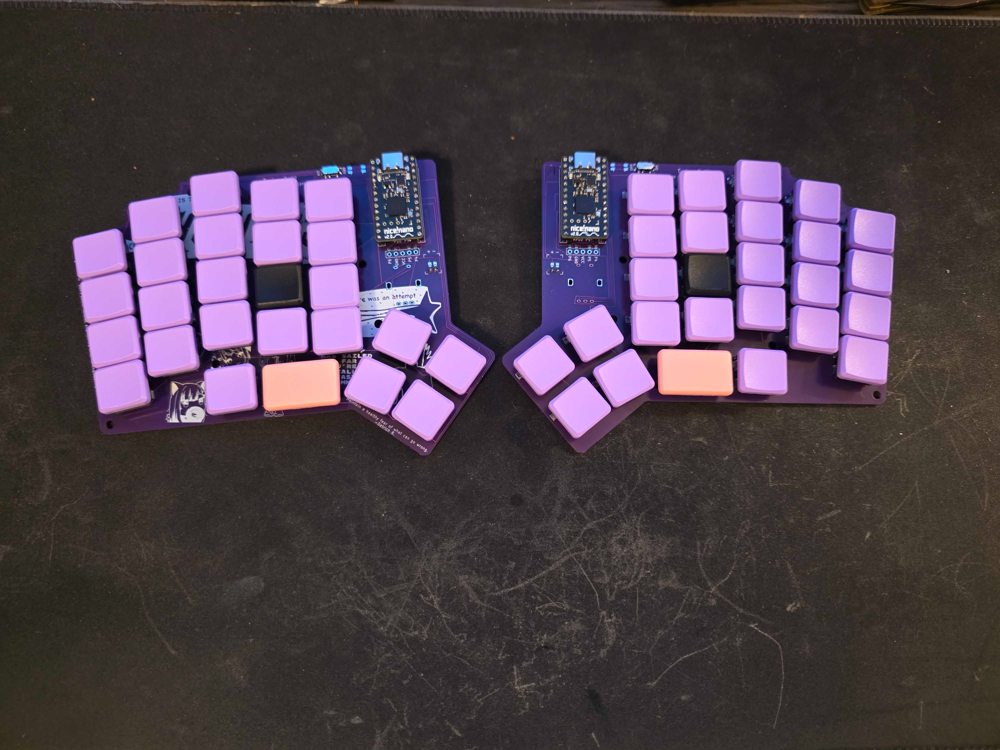
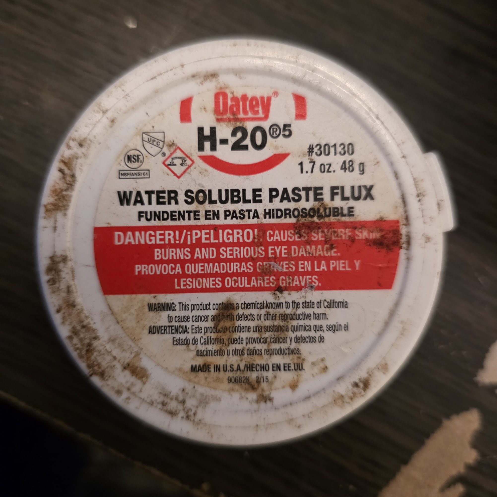

# da blawg

I tried to build this keyboard ~3 or 4 months ago, so I'm not actually remembering it super well. Here's my best attempt at logging the process, though

this is the silkscreen!

it so pretty :D

soldering the sockets went really well. this was the easiest part by sure and really satisfying to do

Soldering the diodes on was also a great time. Very peaceful to put such tiny things onto a keyboard.

the finished thing!

...and then I tried to test it.
This did not go well. The right half nice!nano instantly died when I plugged the battery in. Here's me trying to fix a short that I found, before I realized the nice!nano was just fully dead:

[yup](https://cdn.hackclub.com/019d6253-04c4-7141-9fed-82115deee4f8/20250629_034747.mp4)

then I got really desperate trying to fix the nice!nano itself....

[this sucked btw](https://cdn.hackclub.com/019d6253-67ec-7c60-b958-69e68ffd3e81/20250629_051405.mp4)

Fun fact: aerosolized isopropyl alcohol makes you feel almost drunk in just a single breath. It also burns the eyes quite a lot. This is literally the same process humidifiers use and I accidentally did it with 97% IPA. **_Don't do this._** It's so incredibly dangerous.

So what happened? Flux. Flux happened. This is the flux I used:

This is highly corrosive, extremely conductive plumbing flux. I didn't have the lid at the time of soldering and just thought it was really old flux. While it was, it was also just plumbing flux and not what I needed.

While I was putting the pins on the nice!nano, I used a bit of this flux. It melted and coated most of the board. This is what shorted and killed everything, and also why I made a DIY ultrasonic bath. Once again, don't do that with straight isopropryl alcohol without a mask on.

So. A summary of everything that went wrong:

- Used the wrong kind of flux. Caused shorts and slowly ate the PCB.
- Destroyed the millmax pins. I got a pack of [these](https://typeractive.xyz/products/machine-sockets-and-pins) and they SUCKED. Absolutely terrible experience and I'm lasercutting myself a jig for the replacements. Took me almost an hour for 8 pins if I recall correctly. I hate these.
- Thumb cluster kinda sucked, honestly. I managed to get the left half working and actually typed on it for a while while doing a lot of writing assignments in school. [Here's a demo of that, even](https://www.youtube.com/watch?v=3NTreXZmQFI). It's growing on me, my hands have shifted a ton in the past few months and my dexterity is getting way better. I think I'll keep it. I also only had one half of the keyboard working, so I didn't have anywhere near all the controls I should've had.
- Case sucked. Plain and simple, it sucked. I really love the bare PCB look, but I'm going to change it to use a clear acrylic top plate. Need to order some to lasercut, though. I also want to try and figure out how to make it grip the table better, the white acrylic I have slides around a lot. Epoxy is pretty grippy, I might just coat it in some pink dyed epoxy.
